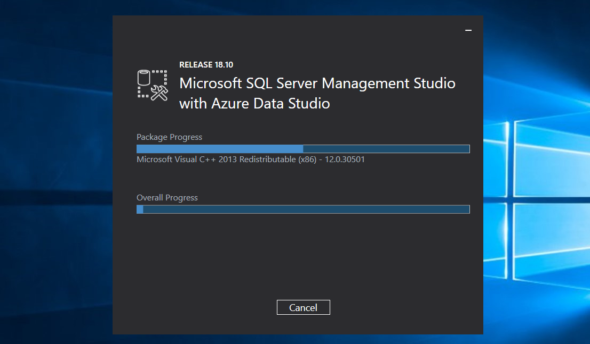

## Creating a test environnement

First things first, we need a test environnement to recreate the setup and try to trigger the authentification. Therefore we need to install:

 - [Microsoft SQL Server 2019](https://www.microsoft.com/en-us/evalcenter/evaluate-sql-server)
 - [SQL Server Management Studio (SSMS)](https://docs.microsoft.com/en-us/sql/ssms/download-sql-server-management-studio-ssms?view=sql-server-ver15)

And then install [SQL Server Management Studio (SSMS)](https://docs.microsoft.com/en-us/sql/ssms/download-sql-server-management-studio-ssms?view=sql-server-ver15):

